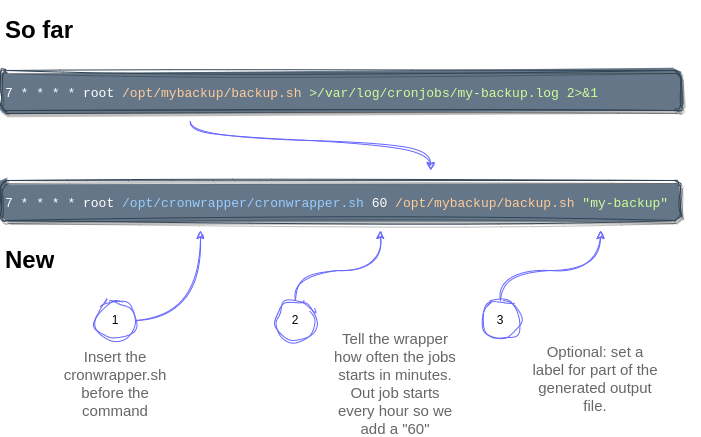

## Quickstart Guide

* Install it: Git clone the repository in /opt
 

* First test run: Start a simple command like `ls`:  `/opt/cronwraper/cronwrapper.sh 1 ls` 
 

* There was no output - because this is what we want in linux cronjobs.
  * To see the status for all cronjobst start `/opt/cronwraper/cronstatus.sh`. 
  * Details you see with `/opt/cronwraper/cronstatus.sh ls`
 

* Edit your first cronjob - edit a crontab or a file in /etc/cron.d/:
  * add "/opt/cronwrapper/cronwrapper.sh" and TTL in [min] before the existing command.
  * The command must be a parameter - if it contains spaces to use parameters, you need to quote it
  * remove the redirect to a file.
  * Example: 
