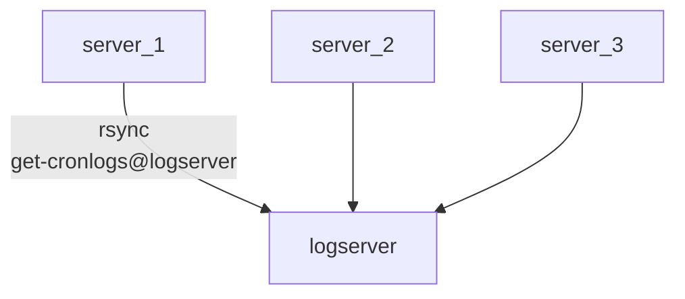

# Cronlog-Sync

## Introduction

The helper script can sync the local logfiles of the cronwrapper
output to central system by using rsync.

You need to prepare such a host first before you can run this script.



Create a target:

* create a target host with ssh, eg. logserver.example.com
* add a local user, eg. get-cronlogs

on local system:

* add a local user, eg. copy-cronlogs
* create a ssh keypair for this user by ssh-keygen
* copy the public key (id_rsa.pub) to target /home/get-cronlogs/.ssh/authorized_keys
* test ssh connect as user copy-cronlogs `ssh get-cronlogs@logserver.example.com echo OK`
* update values SSHKEY and TARGET in `cronstatus.cfg`

## Show help

Use -h to show a help:

```text
> ./cronlog-sync.sh -h
____________________________________________________________________________________

SNYC LOCAL LOGS OF www.example.com
______________________________________________________________________________/ v1.4

HELP:
    This script syncs local cronlogs to a target.
    It should be used as cronjob in /etc/cron.d/ and/ or triggered
    whem any cronwrapper script was fisnished.

SYNTAX:
    cronlog-sync.sh [OPTIONS]

PRAMETERS:
    -f [integer]  time in sec when to force symc without new logs
                  value 0 forces sync
                  current value: [3600]
    -h            show this help
    -i [string]   path to ssh private key file
                  current value: [/home/copy-cronlogs/.ssh/id_rsa@logserver.example.com]
    -l [string]   local  log dir of cronjobs
                  current value: [/var/tmp/cronlogs]
    -q            be more quiet
    -s [integer]  sleep random time .. maximum is given value in seconds
    -t [string]   target dir (local or remote like rsync syntax)
                  current value: [get-cronlogs@logserver.example.com:/var/tmp/allcronlogs/www.example.com]

DEFAULTS:
    see also /opt/cronwrapper/cronwrapper.cfg

EXAMPLES:
    cronlog-sync.sh -s 20 -t [TARGET]   wait max 20 sec before starting sync
    cronlog-sync.sh -q -f 0             be more quiet and force sync (0 sec)

```

Cronlog-sync saves the last successful sync with a touched file.
If does not connect to the target if no newer file exists.
