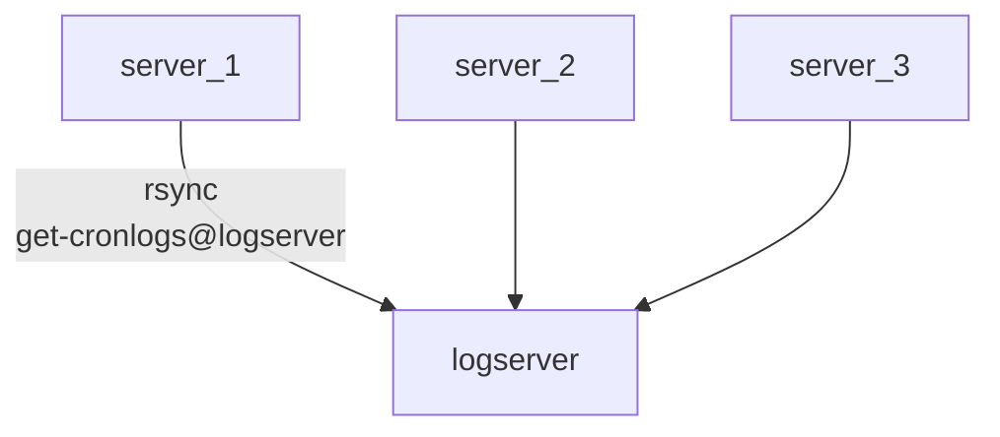

# Cronlog-Sync

## Introduction

The helper script can sync new local logfiles of the cronwrapper
output directory to central system by using rsync.

You need to prepare such a host first before you can run this script.



Create a target:

* create a target host with a ssh server, eg. logserver.example.com
* add a local user, eg. get-cronlogs

on local system:

* add a local user, eg. copy-cronlogs
* create a ssh keypair for this user by ssh-keygen
* copy the public key (id_rsa.pub) to target /home/get-cronlogs/.ssh/authorized_keys
* test ssh connect as user copy-cronlogs `ssh get-cronlogs@logserver.example.com echo OK`
* update values SSHKEY and TARGET in `cronstatus.cfg`

## Show help

Use -h to show a help:

```text
> ./cronlog-sync.sh -h
____________________________________________________________________________________

SNYC LOCAL LOGS OF www.example.com
______________________________________________________________________________/ v1.4

HELP:
    This script syncs local cronlogs to a target.
    It should be used as cronjob in /etc/cron.d/ and/ or triggered
    whem any cronwrapper script was fisnished.

SYNTAX:
    cronlog-sync.sh [OPTIONS]

PRAMETERS:
    -f [integer]  time in sec when to force symc without new logs
                  value 0 forces sync
                  current value: [3600]
    -h            show this help
    -i [string]   path to ssh private key file
                  current value: [/home/copy-cronlogs/.ssh/id_rsa@logserver.example.com]
    -l [string]   local  log dir of cronjobs
                  current value: [/var/tmp/cronlogs]
    -q            be more quiet
    -s [integer]  sleep random time .. maximum is given value in seconds
    -t [string]   target dir (local or remote like rsync syntax)
                  current value: [get-cronlogs@logserver.example.com:/var/tmp/allcronlogs/www.example.com]

DEFAULTS:
    see also /opt/cronwrapper/cronwrapper.cfg

EXAMPLES:
    cronlog-sync.sh -s 20 -t [TARGET]   wait max 20 sec before starting sync
    cronlog-sync.sh -q -f 0             be more quiet and force sync (0 sec)

```

## Automation of the sync

### As cronjob

Cronlog-sync saves the last successful sync with a touched file.
If does not connect to the target if no newer logfile exists. So it can prevent unneeded ssh commands.

[+] simple setup
[-] stupid polling each N minutes - logs arrive with a delay on target logserver

You need to start the `cronlog-sync.sh` with user *copy-cronlogs*.
I suggest to use -s param for a random delay - otherwise all your servers maybe try to connect within the same second.

A cronjob to start the sync every 5 min:

```txt
*/5 * * * * copy-cronlogs /usr/local/bin/cronlog-sync.sh -s 20 > /home/copy-cronlogs/cronlog-sync.log 2>&2
```

### As systemd service

To sync changed logfiles directly after a cronjob is finished
I used a service that watches for changes on the log directory
using the `stat` command.

[+] low delay time
[-] extra installation needed

(1) 
Install onfilechange
<https://git-repo.iml.unibe.ch/iml-open-source/onfilechange>

Docs: <https://os-docs.iml.unibe.ch/onfilechange/index.html>

The script `onfilechange.sh` should be available as `/usr/local/bin/onfilechange.sh`

(2)
We create a service file for a job named *cronjob-watcher*.

```txt
> cat /etc/systemd/system/cronjob-watcher.service
[Unit]
Description=Init Sync after a cronjob was running
Wants=multi-user.target

[Service]
Type=simple
RestartSec=60s
Restart=on-failure
User=copy-cronlogs
Group=copy-cronlogs
LimitNOFILE=4096
LimitNPROC=23868
SyslogIdentifier=cronjob-watcher
ExecStart=/usr/local/bin/onfilechange.sh -f '/var/tmp/cronlogs/' -c '/usr/local/bin/cronlog-sync.sh -q' -s
[Install]
WantedBy=multi-user.target
```
ExecStart contians the command of onfilechange.sh script. Its params are:

* -f FOLDER - the watched folder - the cronlogs output directory
* -c COMMAND - the command to execute is our sync script. It is called with "-q" to have less output in the journallog
* -s - use stat command

Start the servive with
`systemctl start cronjob-watcher`

... and verify if it is running 
`systemctl status cronjob-watcher`

To follow the actions in the journallog you can filter by unit "cronjob-watcher"
`journalctl -u  cronjob-watcher -f`

Last but not least: You maybe want to start the job on system start - so enable it:
`systemctl enable cronjob-watcher`

## Logviewer

TODO: 
on logserver install 

* a webservice with PHP 
* the viewer <https://git-repo.iml.unibe.ch/iml-open-source/cronlog-viewer> into webroot or any subfolder below webroot
