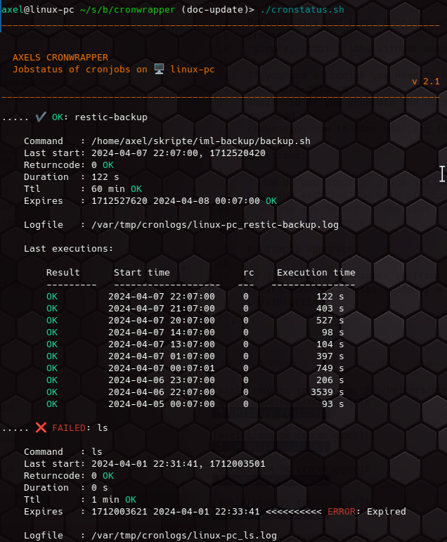

Axels

```text
                                                                           | 
    A  X  E  L  S                                                        --x--
   ______                        ________                                  |
  |      |.----.-----.-----.    |  |  |  |.----.---.-.-----.-----.-----.----.
  |   ---||   _|  _  |     |    |  |  |  ||   _|  _  |  _  |  _  |  -__|   _|
  |______||__| |_____|__|__|    |________||__| |___._|   __|   __|_____|__|  
                                                     |__|  |__|
```

Unix shell scripts in Bash for easier handling of cronjobs.\
A little idea that offers more possibilities.

Free software and Open source.

👤 Author: Axel Hahn \
📄 Source: <https://github.com/axelhahn/cronwrapper> \
📜 License: GNU GPL 3.0 \
📗 Docs: see [www.axel-hahn.de/docs](https://www.axel-hahn.de/docs/cronwrapper/)

## Introduction

Default Unix and linux cronjobs are quite basic stuff. Mostly you create
"simple, stupid" jobs without output ... that just run. Or should.

If you use a cronjob you need to hide the output otherwise the root user gets an 
email. So if you generate the output and have many cronjobs then you need a 
convention how to name your log files.

Questions:

* How do you check if a job was successful? Just trust them? Watching each log? On each of your systems?
* How do you detect if the last job execution was successful but does not run anymore?

My simple approach: 

By just adding a wrapper in front of your current command 
breaks tons of limits! Suddenly a simple action opens so many possibilities.


